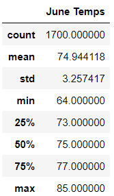
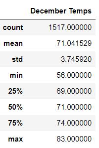

# Surfs_Up Analysis

## Analysis Overview
Surf n' Shake Shop is a business venture that will provide surfboards and ice cream to locals and tourists on the island of Oahu, Hawaii. To move forward with this business plan, an investor is needed. W. Avy, an investor who is famous for his love of surfing, has been approached.

Before committing to funding the Surf n' Shake Shop, W. Avy has requested analytics on a weather dataset he has from Oahu.

## Results
The following tables summarize the temperature data for the months of June and December in Oahu. All measurements are in degrees farenheit.

1. The average temperatures for the months of June and December are relatively similar, with June averaging about 75 degrees and December about 71 degrees.  The maximum temperatures also prove to be similar, with only one degree difference between the two months.

2. Despite the average and maximum temperatures being similar, the minimum temperatures are more drastic. June's minimum recorded temperature was 64 degrees, while December's was 56 degrees, which may affect the demand for surfing and ice cream.

3. The standard deviations for the temperatures recorded in June and those recorded in December are approximately 3.26 and 3.75, respectively. This implies that the temperature fluctuations with each month do not flucuate drastically.

## Summary

Based on the temperature analysis for June and December, it can be concluded that the temperatures are fairly steady in Oahi, regardless of the season - June (summer) or December (winter). The main takeaway and consideration when considering soley temperatures is that the minimum temperature is lower in December. During this month, it may be ideal to adjust the hours of Surf n' Shake Shop so it is open during the warmest times of the day when business may be more in demand.

### Additional queries
The temperature is only one factor that may influence the sucess of Surf n' Shake Shop. Prior to investing, it would be favorable to provide W. Avy with an analysis of the precipitation and the wind speeds for June and December, as both variables may affect the demand for surfing and ice cream.
